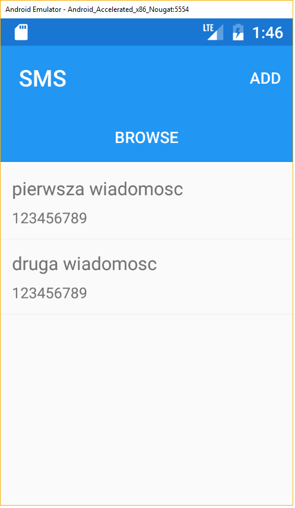

# SMS-Xamarin
SMS-Xamarin is a simple application for sending sms in background. Sms's are fetched from [WebAPI](https://github.com/dyjakstefan/SMS-API)

## Features
* Sending sms in background
* Adding new sms to WebAPI

# Compiling and extending
## Requirements
* Xamarin.Forms

Application use other my project, named [SMS-API](https://github.com/dyjakstefan/SMS-API)
